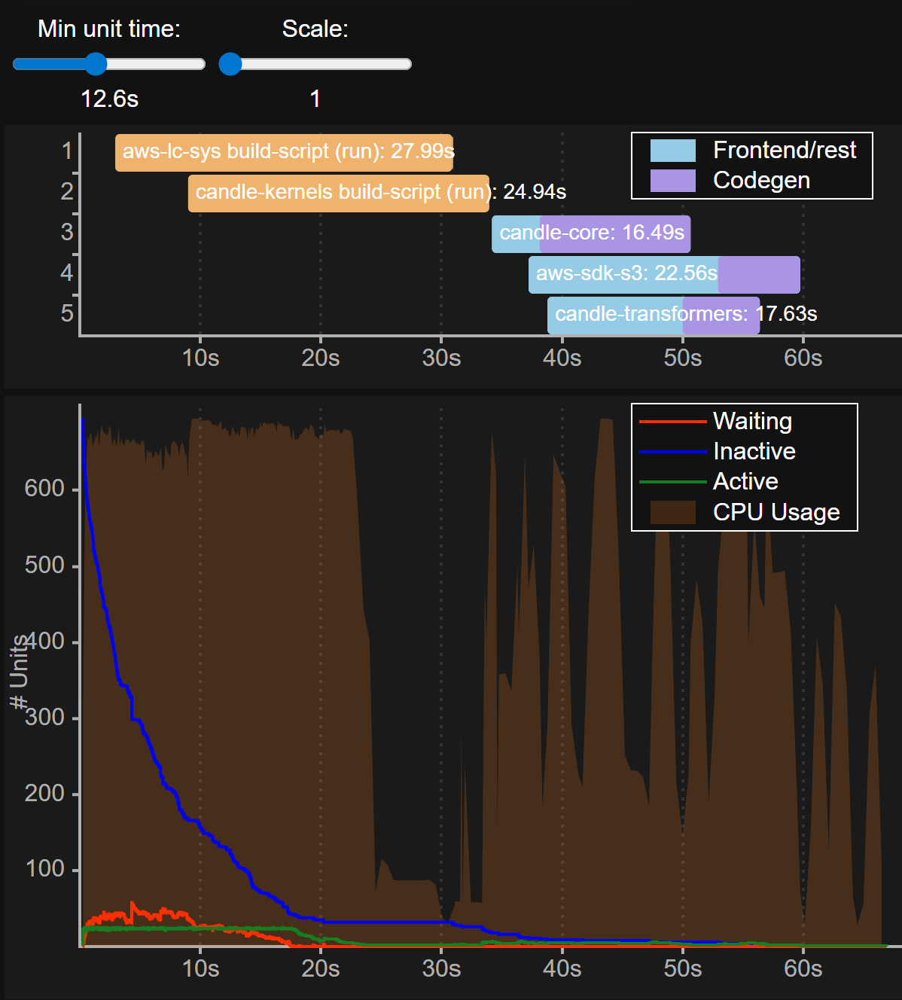
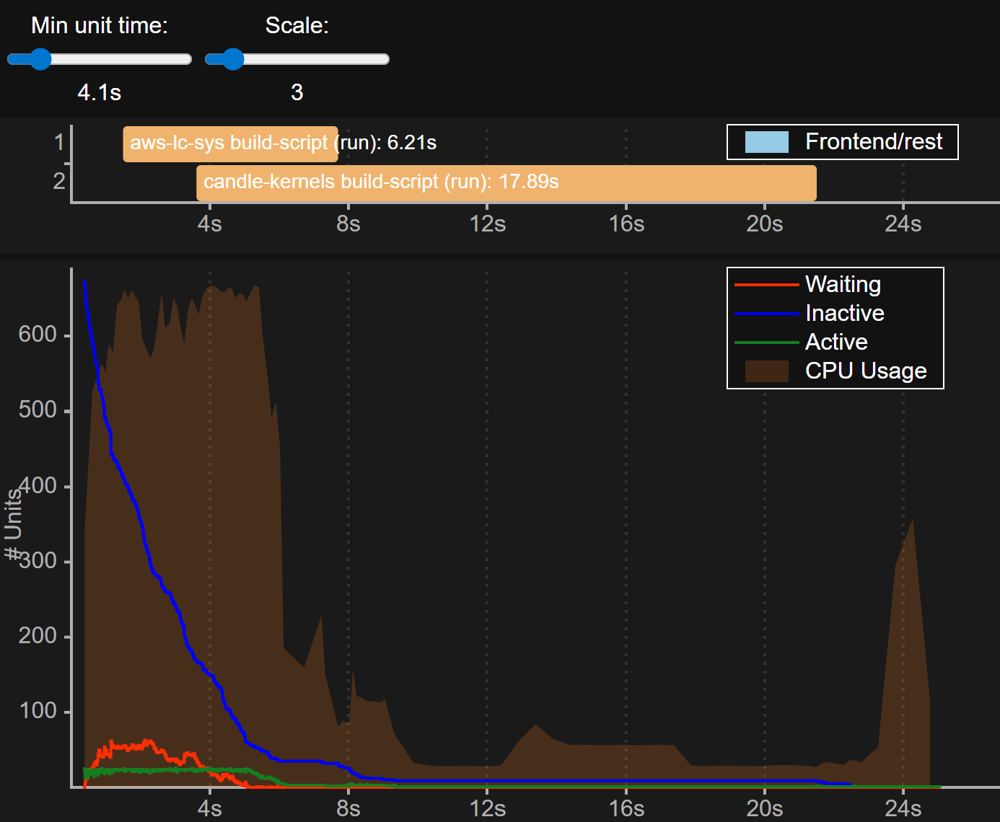

# speeding up rust / whisper-rs build times

i've been working on [Inspectra](https://inspectra.dev) and the backend has grown significantly despite my best efforts to keep it slim. the project is monolithic and pulls in:

* `axum` + `utoipa` for API endpoints
* `ffmpeg-next` + `image` + `cudarc` for video ingestion
* `cudarc` for custom CUDA kernels
* `candle` for DL inference
* `whisper-rs` for [whisper.cpp](https://github.com/ggml-org/whisper.cpp) bindings
* `sea-orm` for DB
* `tokio` for runtime
* and the usual suspects - `serde`, `tracing`, etc.

which lands at ~700 crates and a 3-minute compile. ugh.

those who know me, know i am a huge stickler for pruning Cargo.toml - unused deps still get downloaded and compiled even if no module touches them. i hadnt cleaned up in a while. [`cargo-udeps`](https://crates.io/crates/cargo-udeps) misses a lot, so i did a manual pass and got it down to ~2 minutes.

still no good.

so i went deeper, and i was able to bring it down to **~25s**. the rest of this post walks through the experiments that got me there

## T0 - baseline

### what

no custom profiles or `.cargo/config.toml`. this is the number i'm trying to beat.

### result

| run type | N | mean | median | stddev |
|---|---|---|---|---|
| baseline | 10 | 139.30s | 140.00s | 1.70s |

## T1 - `mold` as linker

### what

i use [`mold`](https://github.com/rui314/mold) on my other projects - particularly [my website](https://github.com/arpadav/website) - where it gives a meaningful speed-up as a drop-in linker.

### config

```toml
# .cargo/config.toml
[target.'cfg(target_os = "linux")']
rustflags = ["-C", "link-arg=-fuse-ld=mold"]
```

### result

| run type | N | mean | median | stddev |
|---|---|---|---|---|
| mold | 10 | 140.00s | 140.00s | 1.41s |

huh, thats weird? barely budged - and if anything, slightly worse.

clearly the time is being spent elsewhere, not on linking. without firing up a profiler, i noticed `whisper-rs-sys` was always the last crate standing, eating 60+ seconds on its own, with a LOT of cpu cores pinned during that stage.


#### `--timings` to confirm

using `cargo build --timings` build made the bottleneck obvious:


| # | unit | total | frontend | codegen | features |
|---|------|-------|----------|---------|----------|
| 1 | whisper-rs-sys v0.15.0 build-script (run) | 114.6s | | | cuda |
| 2 | aws-sdk-s3 v1.119.0 | 51.2s | 23.8s (46%) | 27.4s (54%) | default, default-https-client, rt-tokio, rustls, sigv4a |
| 3 | candle-transformers v0.10.2 | 44.6s | 15.4s (35%) | 29.2s (65%) | cuda, default |
| 4 | candle-core v0.10.2 | 41.8s | 5.4s (13%) | 36.4s (87%) | cuda, cudarc, default |
| 5 | candle-kernels v0.10.2 build-script (run) | 34.6s | | | |
| 6 | aws-lc-sys v0.40.0 build-script (run) | 31.9s | | | prebuilt-nasm |

114.6s on a single build-script is absurd. everything else can run in parallel - `whisper-rs-sys` is the single thread blocking the whole graph from finishing.

## T2 - drop mold, add `whisper` env flags

### what

`whisper-rs-sys` exposes [`WHISPER_DONT_GENERATE_BINDINGS`](https://codeberg.org/tazz4843/whisper-rs/src/commit/3354d83d5535b2e091166a672b45a3c4d912c7d5/sys/build.rs#L119) - set to `1` and it uses a pre-generated `bindings.rs` instead of running `bindgen` from scratch. easy try.

while i was at it, `whisper.cpp` defaults `CMAKE_CUDA_ARCHITECTURES` to `native`, which can re-detect on every clean build. pinning it explicitly has saved a couple seconds for me on other projects (probably negligible here, but free).

### config

```bash
cargo clean && \
  WHISPER_DONT_GENERATE_BINDINGS=1 \
  CMAKE_CUDA_ARCHITECTURES=120a-real \
  cargo build -r --workspace
```

or in my cargo config:

```toml
# .cargo/config.toml
[env]
WHISPER_DONT_GENERATE_BINDINGS = "1"
CMAKE_CUDA_ARCHITECTURES = "120a-real"
```

### result

| run type | N | mean | median | stddev |
|---|---|---|---|---|
| env flags only | 10 | 135.00s | 135.00s | 1.89s |

so the `whisper-rs-sys` build-script itself only dropped 114.6s -> 114.0s, but overall mean shifted from 139.30s -> 135.00s. ~4s saved, basically free, but nowhere near the win i wanted.

## T4 - `ccache`

### what

since `whisper-rs-sys` is a C/C++/CUDA build under the hood, [`ccache`](https://ccache.dev/) is the natural lever. point cmake's compiler launchers at `ccache` and stash the cache inside the project so it survives `cargo clean`.

### config

```toml
# .cargo/config.toml
[env]
WHISPER_DONT_GENERATE_BINDINGS = "1"
CMAKE_CUDA_ARCHITECTURES = "120a-real"

CMAKE_C_COMPILER_LAUNCHER = "ccache"
CMAKE_CXX_COMPILER_LAUNCHER = "ccache"
CMAKE_CUDA_COMPILER_LAUNCHER = "ccache"
CCACHE_DIR = { value = ".cache/ccache", relative = true }
CCACHE_NOHASHDIR = "1"
CCACHE_BASEDIR = { value = ".", relative = true }
```

### result

| run type | N | mean | median | stddev |
|---|---|---|---|---|
| cold (no cache yet) | 3 | 139.33s | 140.00s | 4.04s |
| warm (cache populated) | 9 | 65.56s | 66.00s | 0.53s |

cold is roughly the same as baseline - expected, since the first compile has to populate the cache. warm cuts it in half. and the new `--timings` ranking confirms `whisper-rs-sys` is no longer the elephant in the room:



| # | unit | total | frontend | codegen | features |
|---|------|-------|----------|---------|----------|
| 1 | aws-lc-sys v0.40.0 build-script (run) | 28.0s | | | prebuilt-nasm |
| 2 | candle-kernels v0.10.2 build-script (run) | 24.9s | | | |
| 3 | aws-sdk-s3 v1.119.0 | 22.6s | 15.7s (70%) | 6.8s (30%) | default, default-https-client, rt-tokio, rustls, sigv4a |
| 4 | candle-transformers v0.10.2 | 17.6s | 11.2s (64%) | 6.4s (36%) | cuda, default |
| 5 | candle-core v0.10.2 | 16.5s | 4.0s (24%) | 12.5s (76%) | cuda, cudarc, default |

now the bottleneck has shifted to the rust crates themselves. which means time to bring `mold` back, and start caching rust too.

## T5 - `ccache` + `mold`

### what

same `ccache` setup, plus mold back as the linker.

### config

```toml
# .cargo/config.toml
[target.'cfg(target_os = "linux")']
rustflags = ["-C", "link-arg=-fuse-ld=mold"]

[env]
WHISPER_DONT_GENERATE_BINDINGS = "1"
CMAKE_CUDA_ARCHITECTURES = "120a-real"

CMAKE_C_COMPILER_LAUNCHER = "ccache"
CMAKE_CXX_COMPILER_LAUNCHER = "ccache"
CMAKE_CUDA_COMPILER_LAUNCHER = "ccache"
CCACHE_DIR = { value = ".cache/ccache", relative = true }
CCACHE_NOHASHDIR = "1"
CCACHE_BASEDIR = { value = ".", relative = true }
```

### result

| run type | N | mean | median | stddev |
|---|---|---|---|---|
| cold | 1 | 135.00s | 135.00s | n/a |
| warm | 3 | 65.67s | 66.00s | 0.58s |

within noise of T4. mold is still doing nothing here - the link step just isnt where the wall-clock is going. so the next move is to actually cache the rust compilation, which means swapping `ccache` for [`sccache`](https://github.com/mozilla/sccache) (it caches both rust and C/C++).

## T6 - `sccache` + `ccache`?

### what

`sccache` wraps `rustc` directly, so it can cache rust crate compilation across `cargo clean`s. before dropping `ccache` entirely, try stacking the two - `sccache` for rust, `ccache` for the cmake-driven C/C++/CUDA paths.

### config

```toml
# .cargo/config.toml
[target.'cfg(target_os = "linux")']
rustflags = ["-C", "link-arg=-fuse-ld=mold"]

[build]
rustc-wrapper = "sccache"

[env]
WHISPER_DONT_GENERATE_BINDINGS = "1"
CMAKE_CUDA_ARCHITECTURES = "120a-real"
SCCACHE_DIR = { value = ".cache/sccache", relative = true }

CMAKE_C_COMPILER_LAUNCHER = "ccache"
CMAKE_CXX_COMPILER_LAUNCHER = "ccache"
CMAKE_CUDA_COMPILER_LAUNCHER = "ccache"
CCACHE_DIR = { value = ".cache/ccache", relative = true }
CCACHE_NOHASHDIR = "1"
CCACHE_BASEDIR = { value = ".", relative = true }
```

### result

| run type | N | mean | median | stddev |
|---|---|---|---|---|
| cold | 3 | 143.33s | 144.00s | 1.15s |
| warm | 9 | 25.07s | 24.88s | 0.59s |

big jump - warm goes from ~65s (T5) to ~25s. cold is slightly worse than baseline, same overhead story as T4. the question now is whether `ccache` is still pulling its weight, or `sccache` alone is doing all the work.

## T7.pre - just `sccache`

### what

also dropped mold

drop `ccache` and let `sccache` handle everything it can. `sccache` only wraps `rustc`, but if the C/C++/CUDA build-scripts are already small relative to the rust compilation, removing `ccache` should have little effect.

### config

```toml
# .cargo/config.toml
[build]
rustc-wrapper = "sccache"

[env]
WHISPER_DONT_GENERATE_BINDINGS = "1"
CMAKE_CUDA_ARCHITECTURES = "120a-real"
SCCACHE_DIR = { value = ".cache/sccache", relative = true }
```

### result

cold:

0. 145s

warm:

0. 26.62s
1. 24.93s
2. 24.94s
3. 24.96s
4. 24.81s
5. 24.78s
6. 24.85s
7. 25.01s
8. 24.78s
9. 24.86s

## T7 - just `sccache`

### what

re-introduce mold

### config

```toml
# .cargo/config.toml
[target.'cfg(target_os = "linux")']
rustflags = ["-C", "link-arg=-fuse-ld=mold"]

[build]
rustc-wrapper = "sccache"

[env]
WHISPER_DONT_GENERATE_BINDINGS = "1"
CMAKE_CUDA_ARCHITECTURES = "120a-real"
SCCACHE_DIR = { value = ".cache/sccache", relative = true }
```

### result

| run type | N | mean | median | stddev |
|---|---|---|---|---|
| release - cold | 1 | 145.00s | 145.00s | n/a |
| release - warm | 5 | 25.35s | 25.07s | 0.77s |
| debug - cold | 1 | 121.00s | 121.00s | n/a |
| debug - warm | 2 | 31.64s | 31.64s | 0.02s |

cold release is slightly worse than baseline (145s vs 139s) since sccache has overhead populating the cache, but the **warm release is 25.35s, down from a 139.30s baseline** - a ~5.5x speedup on the steady-state developer loop. T6 vs T7 is within noise, so `ccache` was contributing essentially nothing once `sccache` was in place.

`--timings` on the warm path confirms what's left isnt cacheable rust - its build-scripts:



| # | unit | total | frontend | codegen | features |
|---|------|-------|----------|---------|----------|
| 1 | candle-kernels v0.10.2 build-script (run) | 17.9s | | | |
| 2 | aws-lc-sys v0.40.0 build-script (run) | 6.2s | | | prebuilt-nasm |

partial timings sum: ~82s (the rest is parallelized away by the cache).

interestingly, **debug warm (31.64s) is _slower_ than release warm (25.35s)** - sccache caches release artifacts more aggressively in this configuration. didnt expect that.

## what's left - candle-kernels

even with `sccache` carrying the rust crates, the warm `--timings` table shows `candle-kernels v0.10.2` build-script still costs **17.9s** every clean build. cracking open the registry source at `~/.cargo/registry/src/index.crates.io-*/candle-kernels-0.10.2/build.rs` explains why:

* it uses [`cudaforge::KernelBuilder`](https://crates.io/crates/cudaforge) to compile **14 `.cu` files** under `src/` into PTX (everything except `moe_*.cu`)
* then compiles 3 MoE kernels (`moe_gguf.cu`, `moe_wmma.cu`, `moe_wmma_gguf.cu`) into a static `libmoe.a` that gets linked into the rust crate
* compiler flags: `--expt-relaxed-constexpr -std=c++17 -O3`, plus `-Xcompiler -fPIC` on linux

the kicker: `cudaforge` spawns `nvcc` directly via `Command::new`. there's no CMake in the loop, so the `CMAKE_CUDA_COMPILER_LAUNCHER = ccache` hook from T4-T6 never fires for these compiles. and `sccache` is a `rustc` wrapper - build-scripts (and the `nvcc` they spawn) are out of scope. so every `cargo clean` re-runs `nvcc` on 17 `.cu` translation units with no cache layer in front of it. that fits the observed ~17.9s pretty well.

cracking this one open is future work - probably either teaching `cudaforge` to honor a launcher env var, wrapping `nvcc` with `sccache` directly, or persisting the `OUT_DIR` across cleans somehow.

## summary

| config | warm mean | speedup vs T0 |
|---|---|---|
| T0 baseline | 139.30s | 1.0x |
| T1 mold only | 140.00s | ~0.99x |
| T2 env flags | 135.00s | 1.03x |
| T4 ccache | 65.56s | 2.13x |
| T5 ccache + mold | 65.67s | 2.12x |
| T6 sccache + ccache + mold | 25.07s | 5.56x |
| T7 sccache + mold | **25.35s** | **5.50x** |

you might be asking why im not doing T6, reason being the `ccache` and `sccache` directories are basically the same size, and for 300ms im not going to require a whole other build system. and i did not expect `mold` to not work as good here, since i assume linking is not the bottle-neck in any case, so dropping it is negligable 
